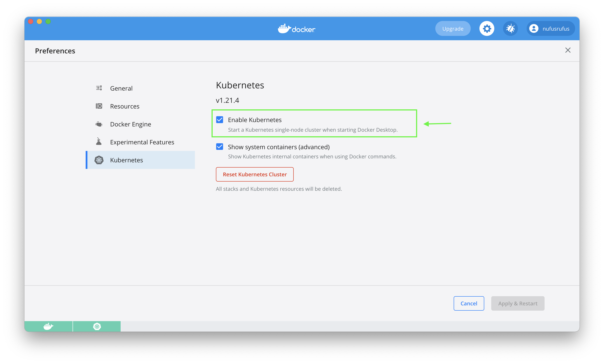

# K8s StatefulSet
## Prerequisites
I haven't installed [minikube](https://minikube.sigs.k8s.io/docs/start/) for this lab, I just used [built-in Kubernetes into Docker Desktop](https://docs.docker.com/desktop/kubernetes/): 


## Steps
1. Put an output of `kubectl get po,sts,svc,pvc` command:
    ```bash
    $ kubectl get po,sts,svc,pvc
    NAME           READY   STATUS    RESTARTS   AGE
    pod/my-app-0   1/1     Running   0          54s
    pod/my-app-1   1/1     Running   0          42s
    pod/my-app-2   1/1     Running   0          30s

    NAME                      READY   AGE
    statefulset.apps/my-app   3/3     54s

    NAME                  TYPE           CLUSTER-IP       EXTERNAL-IP   PORT(S)          AGE
    service/app-service   LoadBalancer   10.103.108.242   localhost     8000:30582/TCP   54s
    service/kubernetes    ClusterIP      10.96.0.1        <none>        443/TCP          52d

    NAME                                                            STATUS   VOLUME                                     CAPACITY   ACCESS MODES   STORAGECLASS   AGE
    persistentvolumeclaim/visits-my-app-0                           Bound    pvc-69167afd-5da3-4fc1-b016-5e773511a451   256M       RWO            hostpath       54s
    persistentvolumeclaim/visits-my-app-1                           Bound    pvc-f3008d0e-c01a-4ef0-8f6a-0c93a2b98d58   256M       RWO            hostpath       42s
    persistentvolumeclaim/visits-my-app-2                           Bound    pvc-90278e4e-1ae2-4f80-ba03-0e40421bfbb1   256M       RWO            hostpath       30s
    ```
2. Use several tabs in your browser, incognito mode, etc to access the root path of your app.
3. Check the content of your file in each pod, provide the output of the command for all replicas.
    ```bash
    $ kubectl exec pod/my-app-0 -- cat data/visits.json
    Accessed at: 19:59:57
    Accessed at: 20:7:29
    Accessed at: 20:7:36
    Accessed at: 20:7:46
    Accessed at: 20:7:46
    Accessed at: 20:7:56

    $ kubectl exec pod/my-app-1 -- cat data/visits.json
    Accessed at: 20:1:34
    Accessed at: 20:7:12
    Accessed at: 20:7:24
    Accessed at: 20:7:36

    $ kubectl exec pod/my-app-2 -- cat data/visits.json
    Accessed at: 20:0:7
    Accessed at: 20:0:27
    Accessed at: 20:0:36
    Accessed at: 20:1:0
    Accessed at: 20:1:22
    Accessed at: 20:1:36
    Accessed at: 20:7:30
    Accessed at: 20:7:46
    ```
4. Describe and explain in the report the differences between the output of the command for
replicas: 
    If we had used Deployment, then we can have one PVC, and visits from all pods would be the same. 
    However it's not a good idea to have one PVC for several pods. You can imagine how 3 pods 
    are trying to read and write simultaneously. So, here in StatefulSet configuration, we have
    `volumeClaimTemplates` which is a template for PVC for each pod, so each pod will have it's own PVC.
    That's why the output different, cause accessing time of each pod goes to separate PVC.
5. For our app ordering guarantee are unnecessary. Describe in the report why: 
    
    Ordering is needed when we have logic between pods, for example, in Postgres. 
    However here our pods are independent from each other, so we can launch and 
    terminate them in parallel without any loose.
6. Then find a way to tell to the StatefulSet controller to launch or terminate all Pods in parallel. Implement it:

    It is implemented through adding `podManagementPolicy: "Parallel"` to StatefulSet spec.
    ```bash
    $ kubectl get po                                   
    NAME       READY   STATUS    RESTARTS   AGE
    my-app-0   0/1     Running   0          7s
    my-app-1   0/1     Running   0          7s
    my-app-2   0/1     Running   0          7s
    ```
