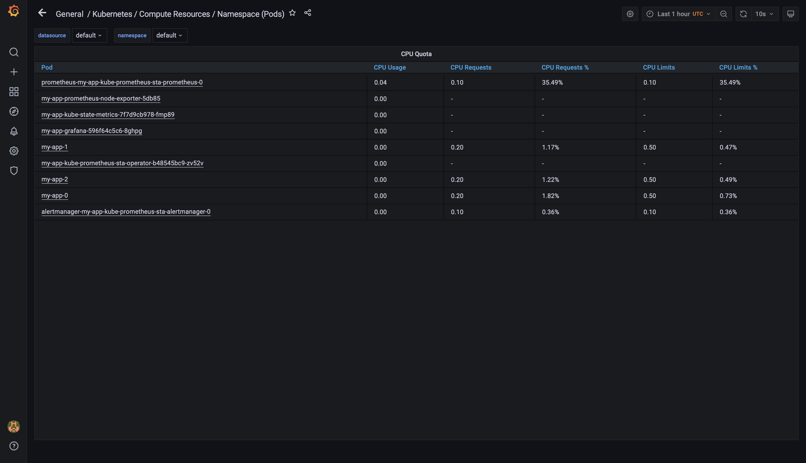
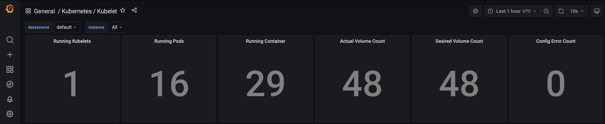

# K8s
## Prerequisites
I have used [minikube](https://minikube.sigs.k8s.io/docs/start/) for this lab, with [built-in Kubernetes into Docker Desktop](https://docs.docker.com/desktop/kubernetes/) I had the following error on MacOS due to [the problem of getting logs on MacOS](https://stackoverflow.com/questions/48180981/docker-container-log-file-not-found-on-mac/48183300#48183300): 
```bash
$ kubectl logs daemonset.apps/my-app-prometheus-node-exporter
failed to try resolving symlinks in path "/var/log/pods/default_my-app-prometheus-node-exporter-fsqzd_4102a732-87aa-4040-a838-cffdb0a8e538/node-exporter/5.log": lstat /var/log/pods
default_my-app-prometheus-node-exporter-fsqzd_4102a732-87aa-4040-a838-cffdb0a8e538/node-exporter/5.log: no such file or directory%
```

## Steps
1. Describe all components of the [Kube Prometheus Stack](https://github.com/prometheus-operator/kube-prometheus#kube-prometheus) and their purpose: 
    * **Prometheus Operator**

        A set of Custom Controllers that we deploy in a cluster. It listens to changes in Custom Resources that were created by Custom Resource Definitions and makes the following changes(updating, deleting, creating and etc.)

        Custom Controller is a system that makes sure that k8s cluster always match the current state that was desired.

        Custom Resource Definition is a way to define our own resource kinds like Deployment, Service, Configmap and etc.

        Custom Resource is a resource defined and created by Custom Resource Definition.
    * **Highly available Prometheus**

        A monitoring system that collects metrics from our services and stores them in a time series database.
    * **Highly available Alertmanager**

        A tool for processing alerts sent by client applications such as Prometheus Server. It eliminates duplicates, groups and sends notifications.
    * **Prometheus node-exporter**

        Collects hardware and OS metrics about Node computing resources in K8s.
    * **Prometheus Adapter for K8s Metrics APIs**

        Helps us to use the metrics collected by Prometheus for making scaling decisions. These metrics are exposed by an API service and can be readily used by Horizontal Pod Autoscaling(HPA).
    * **kube-state-metrics**

        Collects metrics from all K8s nodes served by Kubelet via the Summary API.
    * **Grafana**

        A web application for interactive visualization and analytics. It can gather the data from Prometheus, InfluxDB, Elasticsearch and etc.
2. I have installed the [Kube Prometheus Stack helm chart](https://github.com/prometheus-community/helm-charts/tree/main/charts/kube-prometheus-stack) as a dependency to my app's helm chart: 
    ```bash
    helm dependency build my-app
    helm install my-app my-app
    ```
3. Provide the output of the `kubectl get po,sts,svc,pvc,cm` command. This command means getting information about pods, statefulsets, services, persistent volume claims and configmaps that we deployed into our k8s cluster:
    ```bash
    $ kubectl get po,sts,svc,pvc,cm
    NAME                                                         READY   STATUS    RESTARTS   AGE
    pod/alertmanager-my-app-kube-prometheus-sta-alertmanager-0   2/2     Running   0          5m45s
    pod/my-app-0                                                 1/1     Running   0          6m8s
    pod/my-app-1                                                 1/1     Running   0          6m8s
    pod/my-app-2                                                 1/1     Running   0          6m8s
    pod/my-app-grafana-596f64c5c6-8ghpg                          2/2     Running   0          6m8s
    pod/my-app-kube-prometheus-sta-operator-b48545bc9-zv52v      1/1     Running   0          6m8s
    pod/my-app-kube-state-metrics-7f7d9cb978-fmp89               1/1     Running   0          6m8s
    pod/my-app-prometheus-node-exporter-5db85                    1/1     Running   0          6m8s
    pod/prometheus-my-app-kube-prometheus-sta-prometheus-0       2/2     Running   0          5m44s

    NAME                                                                    READY   AGE
    statefulset.apps/alertmanager-my-app-kube-prometheus-sta-alertmanager   1/1     5m45s
    statefulset.apps/my-app                                                 3/3     6m8s
    statefulset.apps/prometheus-my-app-kube-prometheus-sta-prometheus       1/1     5m44s

    NAME                                              TYPE           CLUSTER-IP       EXTERNAL-IP   PORT(S)                      AGE
    service/alertmanager-operated                     ClusterIP      None             <none>        9093/TCP,9094/TCP,9094/UDP   5m45s
    service/app-service                               LoadBalancer   10.111.6.134     <pending>     8000:30916/TCP               6m8s
    service/kubernetes                                ClusterIP      10.96.0.1        <none>        443/TCP                      62d
    service/my-app-grafana                            ClusterIP      10.102.97.101    <none>        80/TCP                       6m8s
    service/my-app-kube-prometheus-sta-alertmanager   ClusterIP      10.103.234.121   <none>        9093/TCP                     6m8s
    service/my-app-kube-prometheus-sta-operator       ClusterIP      10.107.165.92    <none>        443/TCP                      6m8s
    service/my-app-kube-prometheus-sta-prometheus     ClusterIP      10.100.51.205    <none>        9090/TCP                     6m8s
    service/my-app-kube-state-metrics                 ClusterIP      10.106.63.19     <none>        8080/TCP                     6m8s
    service/my-app-prometheus-node-exporter           ClusterIP      10.100.221.230   <none>        9100/TCP                     6m8s
    service/prometheus-operated                       ClusterIP      None             <none>        9090/TCP                     5m44s

    NAME                                                            STATUS   VOLUME                                     CAPACITY   ACCESS MODES   STORAGECLASS   AGE
    persistentvolumeclaim/visits-my-app-0                           Bound    pvc-2b6f07b0-b6e5-4b1a-b636-b3f916604704   256M       RWO            standard       6m8s
    persistentvolumeclaim/visits-my-app-1                           Bound    pvc-314a6332-0ead-4f42-af4d-2075a6bd419b   256M       RWO            standard       6m8s
    persistentvolumeclaim/visits-my-app-2                           Bound    pvc-3919f964-83d1-45e5-ba84-8fa481d18a80   256M       RWO            standard       6m8s

    NAME                                                                     DATA   AGE
    configmap/kube-root-ca.crt                                               1      62d
    configmap/my-app-grafana                                                 1      6m8s
    configmap/my-app-grafana-config-dashboards                               1      6m8s
    configmap/my-app-grafana-test                                            1      6m8s
    configmap/my-app-kube-prometheus-sta-alertmanager-overview               1      6m8s
    configmap/my-app-kube-prometheus-sta-apiserver                           1      6m8s
    configmap/my-app-kube-prometheus-sta-cluster-total                       1      6m8s
    configmap/my-app-kube-prometheus-sta-controller-manager                  1      6m8s
    configmap/my-app-kube-prometheus-sta-etcd                                1      6m8s
    configmap/my-app-kube-prometheus-sta-grafana-datasource                  1      6m8s
    configmap/my-app-kube-prometheus-sta-k8s-coredns                         1      6m8s
    configmap/my-app-kube-prometheus-sta-k8s-resources-cluster               1      6m8s
    configmap/my-app-kube-prometheus-sta-k8s-resources-namespace             1      6m8s
    configmap/my-app-kube-prometheus-sta-k8s-resources-node                  1      6m8s
    configmap/my-app-kube-prometheus-sta-k8s-resources-pod                   1      6m8s
    configmap/my-app-kube-prometheus-sta-k8s-resources-workload              1      6m8s
    configmap/my-app-kube-prometheus-sta-k8s-resources-workloads-namespace   1      6m8s
    configmap/my-app-kube-prometheus-sta-kubelet                             1      6m8s
    configmap/my-app-kube-prometheus-sta-namespace-by-pod                    1      6m8s
    configmap/my-app-kube-prometheus-sta-namespace-by-workload               1      6m8s
    configmap/my-app-kube-prometheus-sta-node-cluster-rsrc-use               1      6m8s
    configmap/my-app-kube-prometheus-sta-node-rsrc-use                       1      6m8s
    configmap/my-app-kube-prometheus-sta-nodes                               1      6m8s
    configmap/my-app-kube-prometheus-sta-persistentvolumesusage              1      6m8s
    configmap/my-app-kube-prometheus-sta-pod-total                           1      6m8s
    configmap/my-app-kube-prometheus-sta-prometheus                          1      6m8s
    configmap/my-app-kube-prometheus-sta-proxy                               1      6m8s
    configmap/my-app-kube-prometheus-sta-scheduler                           1      6m8s
    configmap/my-app-kube-prometheus-sta-statefulset                         1      6m8s
    configmap/my-app-kube-prometheus-sta-workload-total                      1      6m8s
    configmap/prometheus-my-app-kube-prometheus-sta-prometheus-rulefiles-0   28     5m44s
    ```
4. I have used the `kubectl port-forward svc/my-app-grafana 8080:80` command to access Grafana. Clicked on the Search dashboard button to see all already prepared for me dashboards. With existing dashboards O was able to find the information about my cluster:
    1. Check how much CPU and Memory my StatefulSet is consuming: 

        `0.214 Gb` of Memory and approximately `1%` of CPU 
        
    2. Check which Pod is using CPU more than others and which is less in the default namespace:

        Pod consuming the most CPU:
        * Prometheus pod - `prometheus-my-app-kube-prometheus-sta-prometheus-0`

        Pods not consuming CPU are:
        *  Node exporter - `my-app-prometheus-node-exporter-5db85`
        * Kube state metrics - `my-app-kube-state-metrics-7f7d9cb978-fmp89`
        * Grafana - `my-app-grafana-596f64c5c6-8ghpg`
        * Prometheus Operator - `my-app-kube-prometheus-sta-operator-b48545bc9-zv52v`

        
    3. Check how much memory is used on my node, in `%` and `mb`:
         
    4. Check how many pods and containers actually ran by the Kubelet service: 

        `16` pods and `29` containers:
        
    5. Check which Pod is using network more than others and which is less in the default namespace:

        * The least network usage: `my-app-1`
        * The most network usage: `prometheus-my-app-kube-prometheus-sta-prometheus-0 `
        
    6. Check how many alerts we have. Also we can see them in the [Web UI](http://localhost:9093) by the `kubectl port-forward svc/my-app-kube-prometheus-sta-alertmanager 9093:9093` command.

        `8` alerts:
        

5. Use [Init container](https://kubernetes.io/docs/concepts/workloads/pods/init-containers/) to download any file, like in the [tutorial](https://kubernetes.io/docs/tasks/configure-pod-container/configure-pod-initialization/#create-a-pod-that-has-an-init-container):
    ```bash
    $ kubectl exec pod/my-app-0 -- cat wget/test.html  
    Defaulted container "my-app" out of: my-app, wget (init)
    <html><head></head><body><header>
    <title>http://info.cern.ch</title>
    </header>

    <h1>http://info.cern.ch - home of the first website</h1>
    <p>From here you can:</p>
    <ul>
    <li><a href="http://info.cern.ch/hypertext/WWW/TheProject.html">Browse the first website</a></li>
    <li><a href="http://line-mode.cern.ch/www/hypertext/WWW/TheProject.html">Browse the first website using the line-mode browser simulator</a></li>
    <li><a href="http://home.web.cern.ch/topics/birth-web">Learn about the birth of the web</a></li>
    <li><a href="http://home.web.cern.ch/about">Learn about CERN, the physics laboratory where the web was born</a></li>
    </ul>
    </body></html>
    ```

## References
* https://github.com/prometheus-operator/kube-prometheus#kube-prometheus
* https://www.infracloud.io/blogs/prometheus-operator-helm-guide/
* https://hackernoon.com/how-to-use-prometheus-adapter-to-autoscale-custom-metrics-deployments-p1p3tl0
* https://inostudio.com/blog/articles-devops/nastroyka-kube-prometheus-stack/
