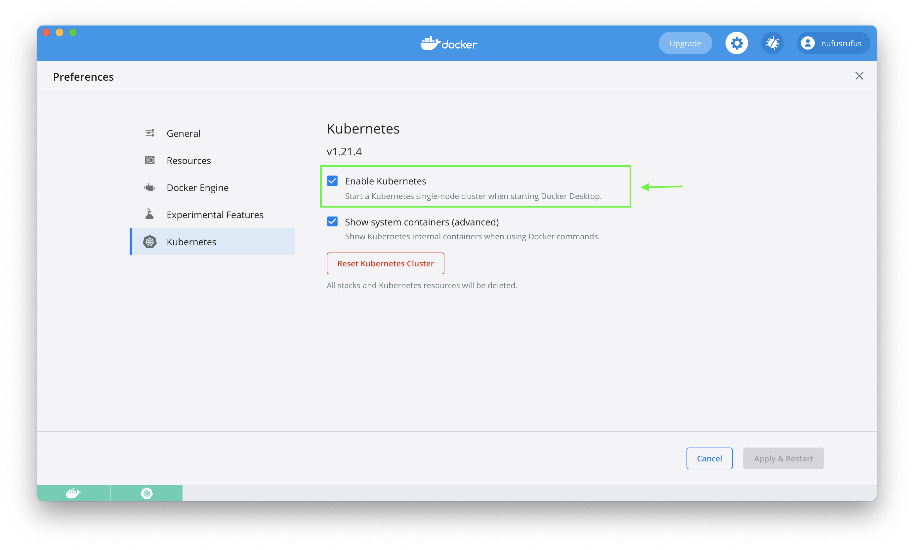

# Kubernetes
## Prerequisites
I haven't installed [minikube](https://minikube.sigs.k8s.io/docs/start/) for this lab, I just used [built-in Kubernetes into Docker Desktop](https://docs.docker.com/desktop/kubernetes/): 


## Steps
1. Deploy your application in the Kubernetes. Use the kubectl create command to create a Deployment:
    
2. Make your application accessible from outside the Kubernetes virtual network. Create a Service for it:
    
3. Provide the output of `kubectl get pods,svc` command:
    
4. Clean up. Remove deployment and service that you created: 
    ```bash
    kubectl delete deployment,svc my-app
    ```
5. Use configuration files to deploy your
application. Create a deployment.yml manifest for it. Set up at least 3 replicas:
    ```bash
    kubectl apply -f deployment.yaml 
    ```
6. Create a service.yml manifest for your app: 
    ```bash
    kubectl apply -f service.yaml 
    ```
7. Provide the output of `kubectl get pods,svc` command:
    
8. Clean up. Remove deployment and service that you created: 
    ```bash
    kubectl delete svc app-service
    kubectl delete deployment app-deployment
    ```
