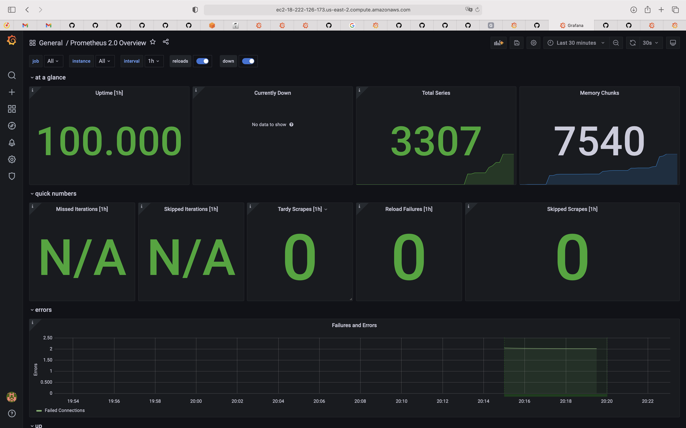

# Monitoring
## Prerequisites
* There are [troubles with accessing docker logs](https://stackoverflow.com/questions/48180981/docker-container-log-file-not-found-on-mac/48183300#48183300) on MacOS , so I decided to configure Ubuntu20.04 based VM on [AWS](https://aws.amazon.com).
* [docker v20.10.8](https://docs.docker.com/engine/install/ubuntu/)
* [docker-compose v1.29.2](https://www.digitalocean.com/community/tutorials/how-to-install-and-use-docker-compose-on-ubuntu-20-04)

## Screenshots

